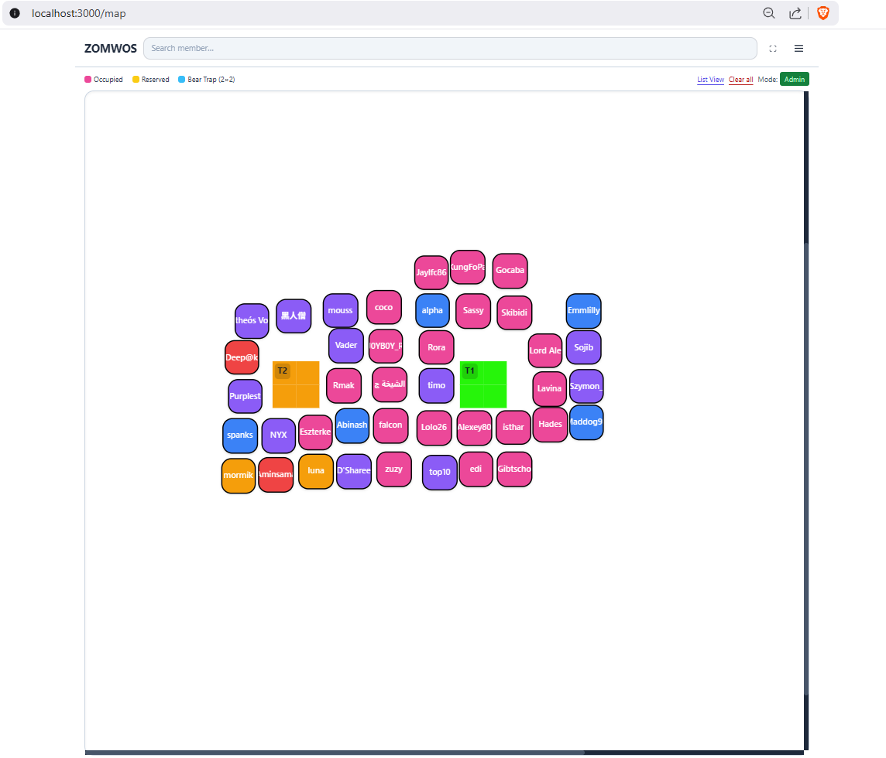

# ZOMWOS – Whiteout Spot Organizer

An admin panel + interactive map to organize alliance cities and bear traps. Built with Node.js, Express, SQLite, and vanilla JavaScript.

This branch introduces free placement with a mobile‑first drag experience.

## Highlights

- Free placement: cities use absolute pixels (`px, py`) and render in an overlay.
- Smooth drag on desktop and mobile (long‑press on mobile) with a high‑contrast ghost preview.
- Visual non‑overlap: prevents dropping cities where they would visually merge.
- Bear traps: long‑press any tile in the trap area (2×2/3×3) to move it, with a labeled ghost.
- Zoom-only menu (Tile Size / City Scale removed for simplicity).
- Live sync: map polls a snapshot; changes land within seconds.
- Audit trail and simple user management (viewer, moderator, admin).

## Demo (local)

- Map view: http://localhost:3000/map
- List view: http://localhost:3000/list

## Quick Start

```bash
git clone https://github.com/zombrax1/wosmap
cd wosmap
npm install
npm start   # or: npm run dev
```

Default admin: `admin` / `admin` (Menu → Admin Login)

## Placement Model (What’s New)

- Cities
  - Stored with tile coords (`x, y`) + absolute pixel center (`px, py`).
  - Rendering prefers `px, py` (exact), falls back to tile center if missing.
  - Desktop: click to open info; drag to move; drop to save.
  - Mobile: tap to open info; long‑press to start drag; map scroll locks during drag.

- Bear Traps
  - Top‑left tile + square size (2×2 by default).
  - Long‑press any tile within the trap to start dragging; drop snaps top‑left to the tile under your finger/cursor.

- Non‑overlap
  - Client blocks city drops where their 1.5×1.5 visual squares would intersect.
  - Server allows multiple cities per tile so visuals stay flexible.

## Configuration

Env vars:
- `PORT` (default 3000)
- `DB_PATH` (default `wos.db`)
- `ADMIN_PASSWORD` (sets admin on first run)
- `CORS_ORIGIN` (optional, for API)
- `SESSION_SECRET` (session cookie secret)

Dev helpers:
- `DB_SINGLETON=false` – open DB per op (tests)
- `RESET_DB=true`    – clear DB on startup

## API (Short)

- Cities: `GET/POST /api/cities`, `PUT /api/cities/:id`, `DELETE /api/cities/:id`  
  Payload supports: `id, name, level, status, x, y, px, py, notes, color`
- Traps: `GET /api/traps`, `POST /api/traps`, `PUT /api/traps/:id`, `DELETE /api/traps/:id`
- Snapshot: `GET /api/snapshot` (ETag)
- Levels: `GET/POST /api/levels`
- Users: `GET/POST/PUT/DELETE /api/users`
- Audit: `GET /api/audit`
- Import/Export: `POST /api/import`, `GET /api/export`

## UI Cheatsheet

- Zoom: Menu → Zoom slider
- Add city: tap/click empty area → Add City (saves `px, py` from the click)
- Drag city (mobile): long‑press then drag; ghost shows where it will land
- Drag trap: long‑press any trap tile then drag; drop snaps top‑left to the tile under finger/cursor

## Data Model

- `cities(id, name, level, status, x, y, px, py, notes, color)`
- `traps(id, slot, x, y, color, notes)`
- `users(id, username, password, role)`, `audit_logs`, `level_colors`

## Development

```bash
npm run dev   # nodemon
npm test      # backend tests
```

Tip: set `RESET_DB=true` for a clean start.

## Accessibility & Mobile

- Long‑press timer ~700ms (`LONG_PRESS_MS` in code)
- Ghost: high‑contrast cyan/red border + label (city short name / T1..T3)
- Long‑press context menus are blocked on touch

## Security

- Session cookies hardened; role‑based access (viewer, moderator, admin)

## Changelog

See `CHANGELOG.md` for the latest updates on this branch.

##Screenshot


